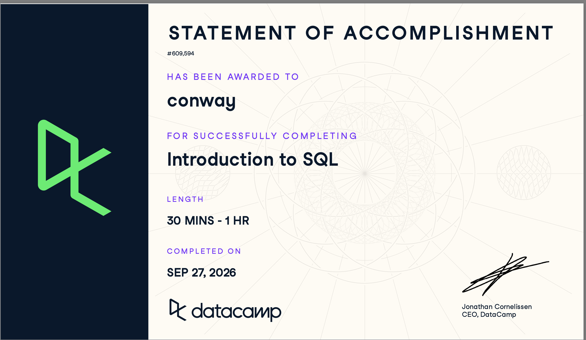

## Completion Evidence



## Main ideas

SQL is a language for working with data stored in relational databases. A database contains tables, a table contains rows, and each column holds one type of information. A unique identifier distinguishes one row from another. Consistent names and appropriate data types make a database easier to maintain and query. In a marketing project, separate customer and transaction tables can avoid repeating customer details on every transaction.

## Important SQL Syntax

This chapter mainly explains database structure rather than introducing many queries. `SELECT` identifies fields to retrieve, and `FROM` identifies the table. The semicolon ends the statement.

## Example

``` sql
SELECT customer_id, email
FROM customers;
```

### Example explanation.

This returns the identifiers and email addresses from the hypothetical `customers` table. A `customer_id` field could uniquely identify each customer even when two people share a name.

## CEP application

I could first identify the tables, fields, identifiers, and data types in a restaurant or marketing dataset. That would help me understand which records represent customers, campaigns, or transactions before analyzing them.

## Querying

A query selects the fields needed to answer a specific question. `SELECT *` retrieves all fields, but listing the needed fields makes a report easier to inspect. `DISTINCT` removes duplicate result rows, while `AS` gives a column a clearer name. A view saves a query for later use. Different database systems can use different syntax for limiting results, so I need to check which SQL flavor I am using.

## Overall Reflection and Future Reference

The most useful skill I learned in this course was how to write a basic SQL query to retrieve specific information from a table. Understanding the difference between a table, a row, and a column also helped me see how data is organized before I start analyzing it. Commands like `SELECT` and `FROM` feel especially useful because I can choose the information I need instead of looking through an entire dataset.

The concept I would like to practice more is creating views and remembering how syntax can differ between SQL systems. For my CEP, SQL could help me pull relevant marketing data, check the types of content or campaigns in a dataset, and prepare information for further analysis. I expect to return to these notes when I need a reminder about `DISTINCT`, aliases, and views.\
\
This is a good foundation to start on but I look forward to learning more SQL as it seems necessary in the workforce today!

## Appendix

-   [GitHub Repository](https://github.com/Spencerconway0/ibm-6500-sql-learning-portfolio.git)
-   [Published Introduction to SQL Report](https://spencerconway0.github.io/ibm-6500-sql-learning-portfolio/introduction-to-sql.html)
